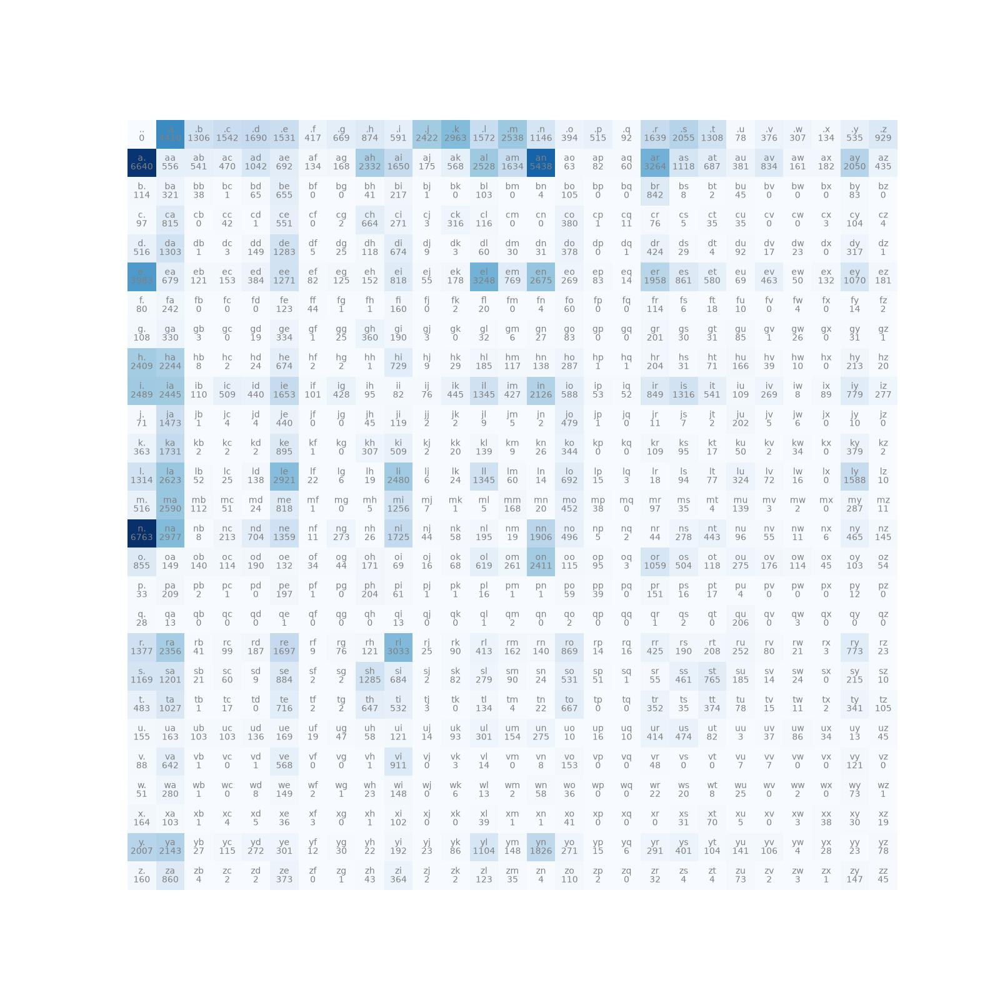
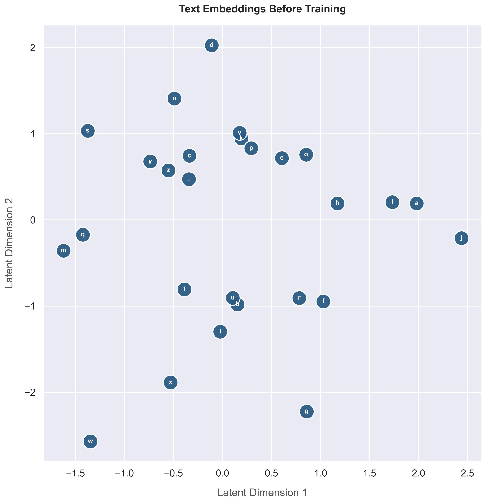
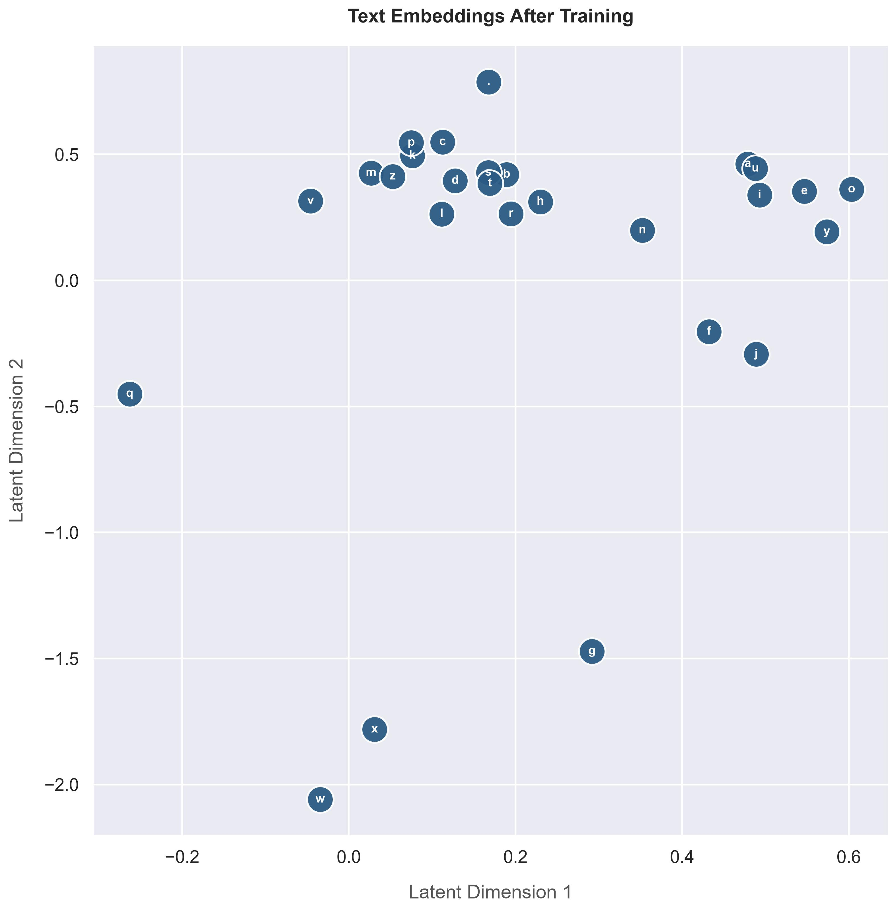
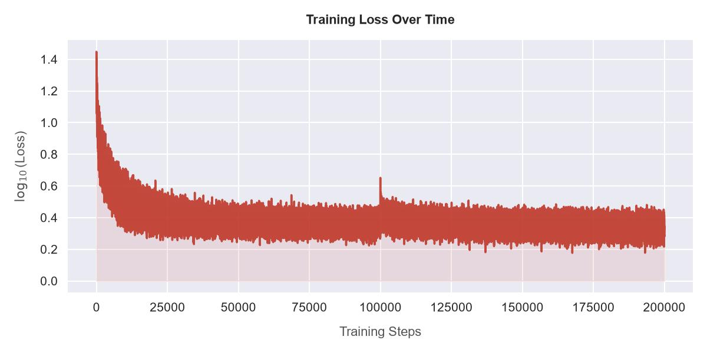
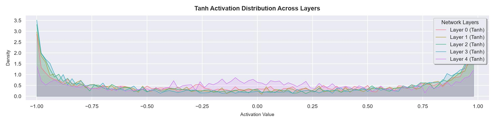
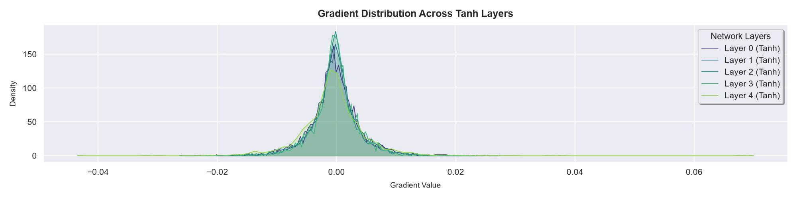
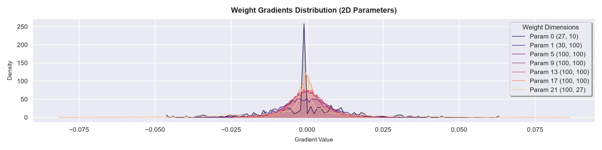
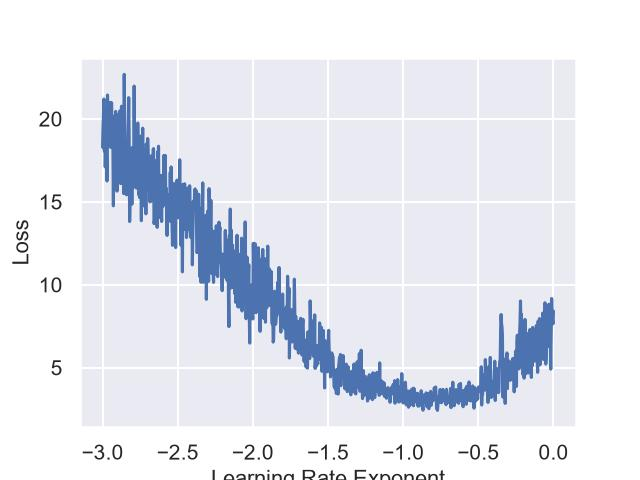
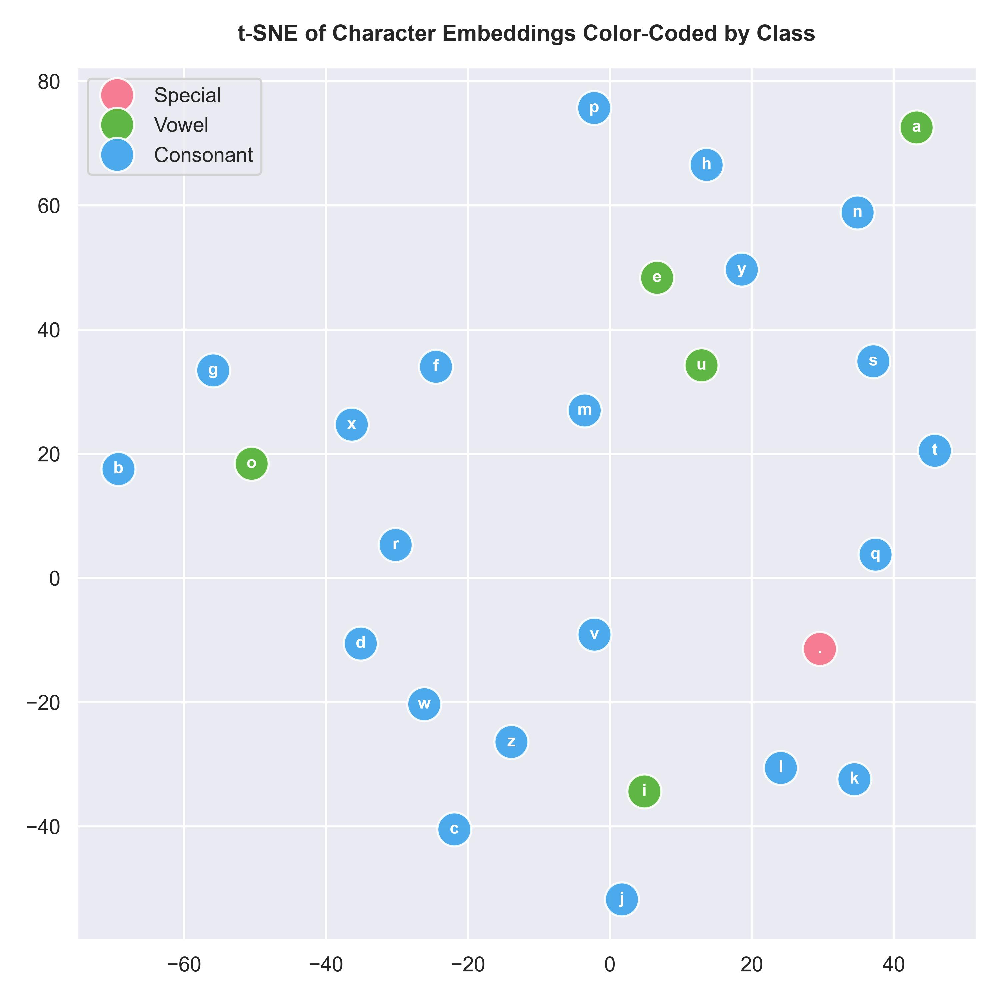
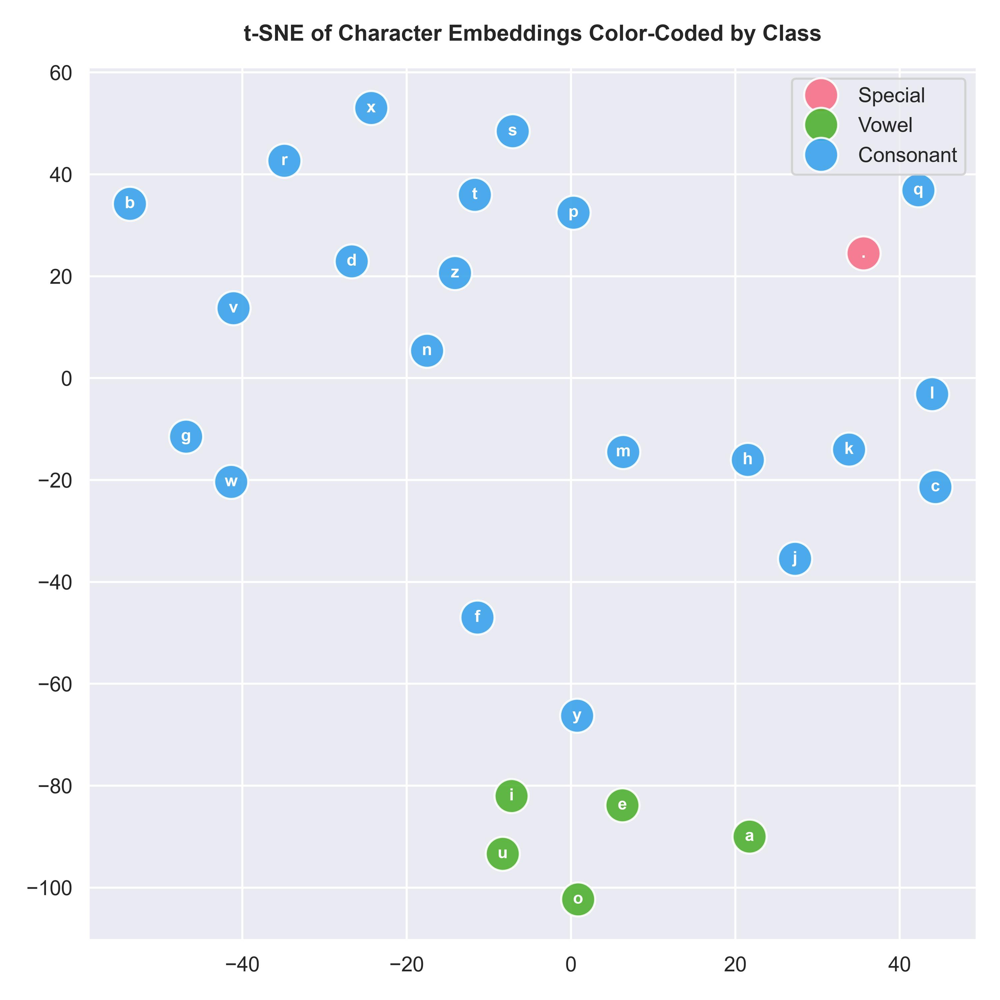

# Intro to Language Modelling

A from-scratch journey through **character-level language modelling**, following Andrej Karpathy's *Neural Networks: Zero to Hero* series.

The goal of this repository is not to build the most sophisticated language model. It is to understand what is happening underneath the abstractions — from counting characters, to learning embeddings, to building an MLP, implementing backpropagation manually, and finally moving toward the hierarchical architecture used in WaveNet.

---

## Learning Progression

```text
Character Frequencies
        ↓
Count-Based Bigram Model
        ↓
Neural Bigram Model
        ↓
Multi-Character Context
        ↓
Character Embeddings
        ↓
Character-Level MLP
        ↓
Batch Normalization
        ↓
Manual Backpropagation
        ↓
WaveNet
```

Each stage is implemented with explicit tensor operations wherever possible.

---

# 1. Count-Based Bigram Model

The first model is a simple statistical language model.

A bigram describes the relationship between two consecutive characters:

```text
(current character, next character)
```

For example:

```text
.emma.

. → e
e → m
m → m
m → a
a → .
```

The model:

- Builds a 27-character vocabulary (`a-z` + `.`)
- Counts character transitions
- Applies Laplace smoothing
- Converts counts into probabilities
- Samples new names
- Evaluates the model using log likelihood / negative log likelihood

### Bigram Distribution



The heatmap shows the learned frequency distribution of character transitions.

---

# 2. Neural Bigram Model

The next step is to express the same idea as a neural network.

```text
Character
   ↓
One-hot encoding
   ↓
Weight matrix
   ↓
Logits
   ↓
Softmax
   ↓
Probability distribution
   ↓
Cross-entropy / NLL
   ↓
Backpropagation
   ↓
Gradient descent
```

The model learns a `27 × 27` weight matrix instead of directly storing the probability table.

This is an important transition: the relationships between characters are now represented by **learned parameters**.

---

# 3. Character-Level MLP

The next model introduces a larger context window.

Instead of predicting the next character from only one previous character, the model uses **three characters of context**.

```text
3 character context
       ↓
Character embeddings
       ↓
Flatten
       ↓
Linear layer
       ↓
BatchNorm
       ↓
tanh
       ↓
Output logits
       ↓
Next-character prediction
```

The model learns a continuous representation for each character instead of using only one-hot vectors.

## Embeddings Before and After Training

The learned character representations can be visualized in two dimensions.

### Before training



### After training



The plots provide a visual look at how the learned representation changes during training.

---

# 4. Deep MLP and Batch Normalization

The MLP was then extended into a deeper network with multiple Linear → BatchNorm → tanh blocks.

The purpose of this stage was to understand:

- Deep networks
- Weight initialization
- Batch normalization
- Running statistics
- Activation distributions
- Gradient distributions
- Parameter update magnitudes
- Training convergence

## Training Convergence



The training-loss curve gives a visual view of how the model converges during optimization.

## Tanh Activation Distributions



This plot shows the distribution of activations across the tanh layers.

## Gradient Distributions



The gradient distributions show how gradients behave across the network.

## Weight Gradient Distributions



This provides another view into the gradients flowing through the trainable weight matrices.

## Learning Rate Exploration



The learning-rate exploration was used to understand the effect of the learning rate on optimization.

---

# 5. Embedding Visualization

The character embeddings can also be projected using t-SNE.

### Before training



### After training



These visualizations provide another way of looking at how the model organizes character representations.

---

# 6. Manual Backpropagation

After building the network using PyTorch tensors, the forward and backward passes were manually derived.

The manual implementation explicitly computes gradients through operations including:

```text
Loss
 ↓
log probabilities
 ↓
probabilities
 ↓
normalization
 ↓
softmax
 ↓
logits
 ↓
Linear layer
 ↓
tanh
 ↓
BatchNorm
 ↓
Linear layer
 ↓
Embeddings
 ↓
Embedding matrix
```

The manually calculated gradients were compared against PyTorch autograd.

The gradients matched exactly for the tested forward pass.

This was an important checkpoint: the goal was to understand not just **how to train a neural network**, but how the gradients actually flow through the computation graph.

---

# 7. WaveNet

The next step was to move from a flat MLP context window to a **hierarchical representation of context**.

The WaveNet implementation uses an 8-character context window and progressively combines neighbouring character representations.

```text
8 character context
        ↓
Character embeddings
        ↓
Flatten pairs
        ↓
4 groups
        ↓
Flatten pairs
        ↓
2 groups
        ↓
Flatten pairs
        ↓
1 group
        ↓
Hidden representation
        ↓
Output logits
        ↓
Next character
```

### Architecture

```text
Embedding(27, 24)
        ↓
FlattenConsecutive(2)
        ↓
Linear(48, 128)
        ↓
BatchNorm
        ↓
tanh
        ↓
FlattenConsecutive(2)
        ↓
Linear(256, 128)
        ↓
BatchNorm
        ↓
tanh
        ↓
FlattenConsecutive(2)
        ↓
Linear(256, 128)
        ↓
BatchNorm
        ↓
tanh
        ↓
Linear(128, 27)
```

### Final WaveNet experiment

Configuration:

| Component | Value |
|---|---:|
| Context window | 8 |
| Embedding dimension | 24 |
| Hidden neurons | 128 |
| Mini-batch size | 32 |
| Training iterations | 200,000 |
| Vocabulary size | 27 |

Final losses:

| Split | Loss |
|---|---:|
| Training | **1.7875** |
| Validation | **1.9917** |
| Test | **1.9869** |

The validation and test losses are very close, which is a useful indication that the final evaluation is consistent across the two held-out splits.

### Generated samples

```text
arlij.
chetzaly.
adona.
caleigha.
djwaid.
mylieanro.
cleo.
karmen.
stibo.
marianah.
astavia.
annayve.
aniah.
jayce.
nodiet.
remit.
dawten.
kolby.
nita.
jaeleah.
```

The generated names are not expected to be real names. They demonstrate that the model has learned character-level patterns from the training data.

---

# Repository Structure

```text
IntroToLanguageModelling/
│
├── Bigrams/
│   ├── bigram_counts.py
│   ├── bigram_model.py
│   ├── bigram_mlp.py
│   ├── bigram_mlp_exploration.py
│   ├── README.md
│   └── utils/
│
├── MLP/
│   ├── CharacterMLP.py
│   ├── CharacterMLP_BackProp.py
│   └── README.md
│
├── nn/
│   ├── Linear.py
│   ├── TanH.py
│   ├── batch_norm_1d.py
│   ├── embedding.py
│   ├── flatten.py
│   ├── flatten_consecutive.py
│   └── sequential.py
│
├── Wavenet.py
├── main.py
├── model_config.py
├── data_exploration.py
├── names.txt
├── requirements.txt
└── README.md
```

---

# Key Concepts Covered

- Character-level language modelling
- Bigram statistics
- Probability distributions
- Laplace smoothing
- One-hot encoding
- Character embeddings
- Multi-character context
- MLPs
- Weight initialization
- Batch normalization
- `tanh`
- Softmax
- Cross-entropy / negative log likelihood
- Mini-batch gradient descent
- Training / validation / test splits
- Manual backpropagation
- Gradient verification
- Hierarchical context aggregation
- WaveNet-style architecture
- Character-level text generation

---

# Philosophy

The implementations intentionally stay close to the underlying tensor operations.

Rather than hiding the mechanics behind high-level frameworks, the project focuses on understanding:

> **What is the model actually doing?**

The progression from counting characters to learning representations and manually deriving gradients is the main learning objective of the repository.
