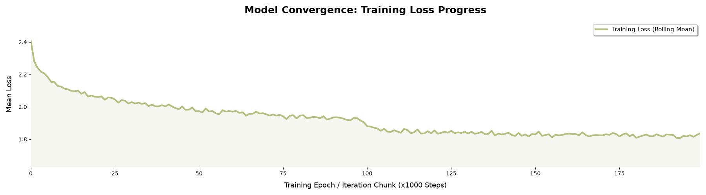

# WaveNet Character-Level Language Model

This directory-level implementation is the next step in the character-level language modelling progression.

The model uses an **8-character context window** and progressively combines neighbouring character representations instead of flattening the entire context at once.

## Architecture

```text
8 character context
        ↓
Character embeddings
        ↓
FlattenConsecutive(2)
        ↓
4 groups
        ↓
FlattenConsecutive(2)
        ↓
2 groups
        ↓
FlattenConsecutive(2)
        ↓
1 group
        ↓
Hidden representation
        ↓
Output logits
        ↓
Next character
```

The final implementation uses:

| Component | Configuration |
|---|---:|
| Context window | 8 |
| Embedding dimension | 24 |
| Hidden neurons | 128 |
| Mini-batch size | 32 |
| Training iterations | 200,000 |
| Vocabulary size | 27 |

```text
Embedding(27, 24)
        ↓
FlattenConsecutive(2)
        ↓
Linear(48, 128)
        ↓
BatchNorm
        ↓
tanh
        ↓
FlattenConsecutive(2)
        ↓
Linear(256, 128)
        ↓
BatchNorm
        ↓
tanh
        ↓
FlattenConsecutive(2)
        ↓
Linear(256, 128)
        ↓
BatchNorm
        ↓
tanh
        ↓
Linear(128, 27)
```

## Training Convergence



The training curve shows a steady reduction in loss over the 200,000 training iterations, followed by a gradual flattening as the model converges.

## Results

Final evaluation:

| Split | Loss |
|---|---:|
| Training | **1.7875** |
| Validation | **1.9917** |
| Test | **1.9869** |

The validation and test losses are very close in this experiment.

## Generated Samples

```text
arlij.
chetzaly.
adona.
caleigha.
djwaid.
mylieanro.
cleo.
karmen.
stibo.
marianah.
astavia.
annayve.
aniah.
jayce.
nodiet.
remit.
dawten.
kolby.
nita.
jaeleah.
```

The generated strings are samples from the model and are not expected to necessarily correspond to real names.

## Implementation

The implementation is contained in:

```text
Wavenet.py
```

The reusable building blocks live in `nn/`, including:

- `Embedding`
- `FlattenConsecutive`
- `Linear`
- `BatchNorm1d`
- `Tanh`
- `Sequential`

The implementation intentionally keeps these components simple so the tensor operations remain visible.
